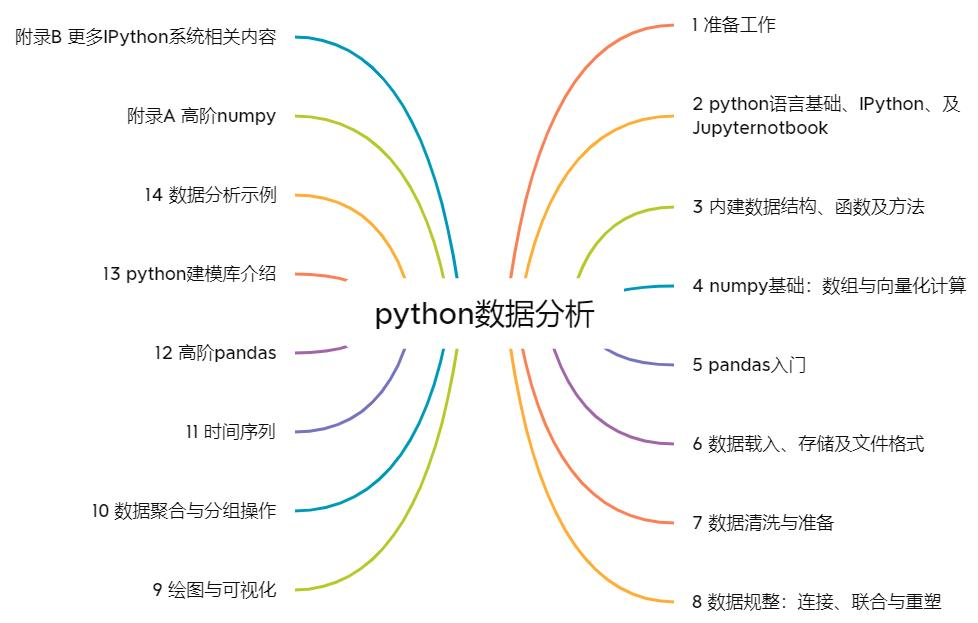

# data_wrangling_with_pandas_numpy_and_ipython
《利用python进行数据分析 第二版》读书笔记

原书代码连接：[https://github.com/wesm/pydata-book](https://github.com/wesm/pydata-book)

尝试使用“阅读-笔记-记忆-输出”的读书闭环进行学习。

学习材料为《利用python进行数据分析 第二版》

1. 首先，阅读简介明确本书的主题，进行问题风暴，猜测作者可能主要讲解的知识点；

2. 对照目录，查看自己的猜题押中了多少；

3. 根据目录，选择自己最关注的几个问题，城市自己先思考回答；

4. 依序阅读，和作者对答案：阅读过程中，先阅读、在回顾记录笔记、整理flomo/Anki卡片。

5. 每日回顾Anki卡片进行记忆。

## 环境信息

python3.7
numpy 1.16.2
pandas 0.24.2

## 目录信息

