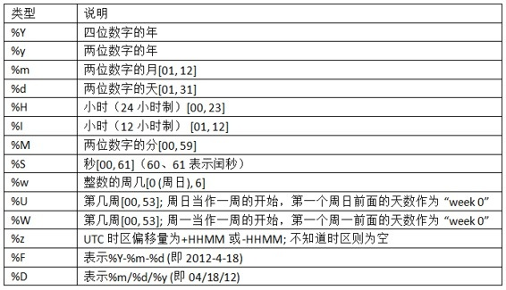

# 第二章 python语法基础，IPython和Jupyter notebook

## 了解python基本语法和IPython基本操作，可以略过

## 1. Python GIL导致了什么结果？
- Python解释器同一时间只能运行一个程序的一条语句。

## 2. Jupyter的内核指什么？
- 内核是Jupyter与其他编程语言的交互编程协议；
- python的Jupyter kernel 使用的是Ipython。

## 3. Jupyter notebook的服务端口是什么？
- 默认是port：8888 
- 启动时如果添加`--no-browser`就不会自动打开浏览器。

## 4. jupyter的`内省`指什么？
- 在变量的前面或后面使用`?`，可以查看对象的信息;
- 使用`??`会显示函数的源码。
> ```python
> In [10]: def add_numbers(a, b):
>     """
>     Add two numbers together
> 
>     Returns
>     -------
>     the_sum : type of arguments
>     """
>     return a + b
> 
> In [11]: add_numbers?
> Signature: add_numbers(a, b)
> Docstring:
> Add two numbers together
> 
> Returns
> -------
> the_sum : type of arguments
> File:      > <ipython-input-9-6a548a216e27>
> Type:      function
> 
> In [12]: add_numbers??
> Signature: add_numbers(a, b)
> Source:
> def add_numbers(a, b):
>         """
>     Add two numbers together
> 
>     Returns
>     -------
>     the_sum : type of arguments
>     """
>     return a + b
> File:      > <ipython-input-9-6a548a216e27>
> Type:      function
> ```
- **补充：** ?结合*通配符还可以用来搜索IPython的命名空间
> ```python
> In [13]: np.*load*?
> np.__loader__
> np.load
> np.loads
> np.loadtxt
> np.pkgload
> ```

## 5. IPython有哪些常用的magic命令？
magic指以`%`或`%%`开头的功能指令。通过执行`%automagic`也可以不输入%。
- %run：

  运行python文件，运行后文件中的变量都可以在IPython shell中继续访问；

  如果想让一个脚本访问IPython已经定义的变量，可以使用 `%run -i`
- %load:

  将python脚本导入到一个cell中
- %paste、 %cpaste：

  直接运行剪贴板中的代码
- % time：
  
  记录单挑语句运行所用时间
- %timeit：
  
  多次运行一条语句，计算平均执行时间
- %pwd：

  显示当前目录位置，其结果可以直接赋值给python变量
- %magic、%quickref：

  显示所有magic命令的文档，显示IPython的快速参考
- %debug、%pdb：

  在出现异常的语句进入调试模式
- %hist：
  
  打印输入命令的历史记录
- %reset：
  
  删除所有命名空间中的变量和名字
- %page：
  
  分页打印对象信息
- %prun：

  用CProfile运行代码，并报告分析器输出
- %who、%who_ls、%whos：

  显示命名空间中的变量
- %xdel：

  删除一个变量，并清空任何对它的引用

## 6. 在IPython和Jupyter中集成Matplotlib绘图有何不同？
- IPython：使用%matplotlib
- Jupyter：使用%matplotlib inline

## 7. IPython中如何执行操作系统shell命令？
- 使用`!+命令`的方式执行

## 8. python中如何使用反射？
- 对对象使用`getattr, hasattr和setattr`方法

## 9. 什么事鸭子类型？
- “走起来像鸭子、叫起来像鸭子，那么它就是鸭子”
- 有时我们不关心对象的类型，而只关心对象是否有某些方法或用途。

## 10. 使用list()方法会复制列表吗？
- 会！list 总是创建一个新的Python列表（即复制）
> ```python
> In [35]: a = [1, 2, 3]
> 
> In [36]: b = a
> 
> In [37]: c = list(a)
> 
> In [38]: a is b
> Out[38]: True
> 
> In [39]: a is not c
> Out[39]: True
> 
> In [40]: a == c
> Out[40]: True
> ```

## 11. python 中的可变对象和不可变对象有哪些？
- 可变对象（对象或包含的值可以改变）：列表、字典、numpy数组、用户自定义的类等；
- 不可变对象(值不能改变，需要赋给新变量)：元组、字符串

## 12. python中整型的长度是多少？
- python中整型是任意精度的，可以存储任意大的数。

## 13. None是什么类型？
- python中None不仅是一个保留字，还是唯一一个`NoneType`的实例。
> ```ipython
> In [101]: type(None)
> Out[101]: NoneType
> ```

## 14. python常用的日期和时间类型有哪些？
python内建的`datetime`库提供了常用的日期和时间类型：
- datetime: 时间日期类型，不可变类型，修改会产生新对象；
- date：日期类型；
- time：时间类型；
- timedelta：时间差类型。

## 15. 时间字符串和对象如何互相转换？
- strftime 方法可以将datetime格式化为字符串；
- strptime 可以将字符串转换成datetime 对象。
> ```ipython
> In [5]: now = datetime.now()
> 
> In [6]: now
> Out[6]: datetime.datetime(2021, 12, 25, 16, 50, 13, 911570)
> 
> In [7]: now.strftime('%Y-%m-%d %H:%M:%S')
> Out[7]: '2021-12-25 16:50:13'
> 
> In [8]: datetime.strptime('20211225', '%Y%m%d')
> Out[8]: datetime.datetime(2021, 12, 25, 0, 0)
> ```
- ISO时间格式化命令：
  
