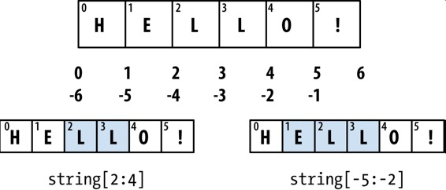
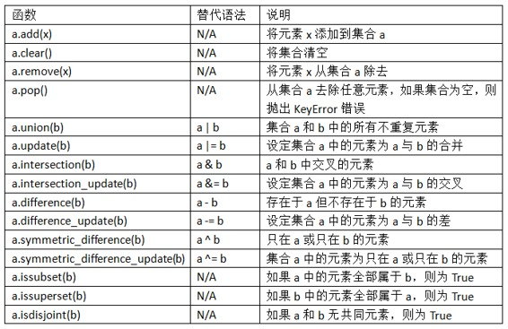
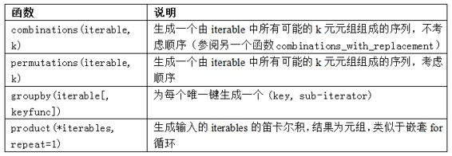
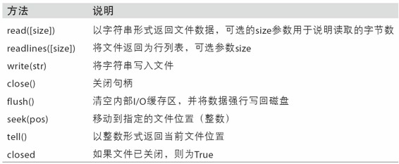

# 第三章 python的数据结构、函数和文件

## 熟悉python语法可以略过

## 1. 元组有哪些特性？
- 固定长度，不可改变
- 使用逗号分割的一列值就是元组，对于复杂的元组可以使用()处理
- 元组中存储的对象可能是可变对象，一旦创建元组，元组中的对象就不能修改了，但是若对象本身是可变的（如列表），则可以在原地对其修改
> ```python
> In [9]: tup = tuple(['foo', [1, 2], True])
> 
> In [10]: tup[2] = False
> ----------------------------------------------------------------> -----------
> TypeError                                 Traceback (most > recent call last)
> <ipython-input-10-c7308343b841> in <module>()
> ----> 1 tup[2] = False
> TypeError: 'tuple' object does not support item assignment
> 
> In [11]: tup[1].append(3)
> 
> In [12]: tup
> Out[12]: ('foo', [1, 2, 3], True)
> ```

## 2. 如何拆分元组？
- 使用创建元组的逆过程进行拆分
- 使用*rest语法，从元组开头摘取几个元素(这里rest的名字不重要，只是惯用写法)
> ```python
>  # 拆分
> In [18]: tup = 4, 5, (6, 7)
> In [19]: a, b, (c, d) = tup
> 
> In [20]: d
> Out[20]: 7
> 
> In [27]: seq = [(1, 2, 3), (4, 5, 6), (7, 8, 9)]
> In [28]: for a, b, c in seq:
>    ....:     print('a={0}, b={1}, c={2}'.format(a, b, c))
> a=1, b=2, c=3
> a=4, b=5, c=6
> a=7, b=8, c=9
> 
> # 取开头几个元素
> In [29]: values = 1, 2, 3, 4, 5
> 
> In [30]: a, b, *rest = values
> 
> In [31]: a, b
> Out[31]: (1, 2)
> 
> In [32]: rest
> Out[32]: [3, 4, 5]
> ```

## 3. 列表有哪些特性？
- 长度可变，内容可被修改
- 常用来实体化迭代器或生成器（如list(range(10))）
- 列表的insert操作耗费的计算量比append大，如果要在序列的头部和尾部插入元素，可以使用**collections.deque**双尾部队列
- 在列表中检查是否存在某个值远比字典和集合速度慢，因为列表时**线性搜索**，字典和集合是**哈希表搜索**。
- 使用extend方法串联列表比使用`+`效率高，因为+需要新建列表并复制对象。
  
## 4. 列表的sort方法和python的sorted方法有哪些异同？
- 相同：都可以对列表排序，都可以按自定义的key排序；
- 不同：sort是在列表原地重排，sorted会产生一个排好序的副本。

## 5. **二分查找**如何使用？
- python内置的bisect模块提供了二分查找和向已排序的列表中插入值的方法：
  - bisect.bisect(a, x)：二分查找将想插入到列表a的合适位置，假设a已排序；
  - bisect.insort(a, x)：在列表a中向找到的位置插入x，假设a已排序。**注意：是insort，不是insert**
- bisect模块不会检查列表是否已经排好序（耗费资源），因此对未排序的列表使用bisect不会产生错误，但结果不一定正确。

## 6. 列表的负数下标代表什么？
- 负数代表从后向前数的位置
  

## 7. 如何对可迭代对象同时返回下标和值？
- 使用enumerate方法

## 8. 如何按对应位置将多个列表或元组组合？
- 使用zip方法
- 组合后的结果长度取决于最短的序列
> ```python
> In [89]: seq1 = ['foo', 'bar', 'baz']
> In [90]: seq2 = ['one', 'two', 'three']
> 
> In [91]: zipped = zip(seq1, seq2)
> 
> In [92]: list(zipped)
> Out[92]: [('foo', 'one'), ('bar', 'two'), ('baz', 'three')]
> ```
- 除了组合，zip还可以解压序列, 把行的列表转换为列的列表
> ```python
> In [96]: pitchers = [('Nolan', 'Ryan'), ('Roger', 'Clemens'),
>    ....:             ('Schilling', 'Curt')]
> 
> In [97]: first_names, last_names = zip(*pitchers)
> 
> In [98]: first_names
> Out[98]: ('Nolan', 'Roger', 'Schilling')
> 
> In [99]: last_names
> Out[99]: ('Ryan', 'Clemens', 'Curt')
> ```

## 9. 如何翻转序列？
- 使用reversed方法
- reversed是一个生成器，需要实体化（list()或用for取值）之后才能创建反转后的序列

## 10. 字典有哪些特性？
- 字典是键值对的大小可变集合
- 可以使用in来检查字典是否含有某个**键**
- 虽然字典的键值对没有顺序，但是使用keys()和values()方法的返回值具有相同的输出顺序
- 默认值：
  - 获取字典内容的默认值：dict.get(key, default_value);
  - 设置默认值：dict.setdefault(key, default_value).opt(), opt表示如果key存在需要执行的操作。
  - 对于设置字典的默认值，推荐使用**collections模块的defaultdict类**
- 有效的键类型：字典的键通常是不可变的标量类型或元组，这被称为**可哈希性**，可以用 **hash()** 函数来检测一个对象是否是可哈希的。

## 11. 集合有哪些特性？
- 无序，不重复
- 可执行集合的数学运算：交、并、差、补等，子集、超集
- 常用操作：

## 12. 哪些数据结构具备推导式？
- 列表：[expr for val in collection if condition]
- 集合：{expr for value in collection if condition}
- 字典：{key-expr : value-expr for value in collection if condition}
- 嵌套列表生成式：
> ```python
> In [161]: all_data = [['John', 'Emily', 'Michael', 'Mary', > 'Steven'],
>    .....:             ['Maria', 'Juan', 'Javier', 'Natalia', > 'Pilar']]
> 
> In [162]: result = [name for names in all_data for name in names
>    .....:           if name.count('e') >= 2]
> ```

## 13. 如何让函数中的局部变量访问函数外部的全局变量？
- 在函数中对要使用的全局变量使用`global`进行声明
- 不推荐频繁使用该操作

## 14. 常用的字符串内容替换方法有哪些？
- str类型的replace方法
- re正则的 sub 方法: re.sub('[!#?]', '', value), 结合正则表达式可以完成高级的替换

## 15. 如何对数据完成一连串的函数操作？
- 将函数运算做成列表进行执行：
> ```python
> def remove_punctuation(value):
>     return re.sub('[!#?]', '', value)
> 
> clean_ops = [str.strip, remove_punctuation, str.title]
> 
> def clean_strings(strings, ops):
>     result = []
>     for value in strings:
>         for function in ops:
>             value = function(value)
>         result.append(value)
>     return result
> ```

## 16. 匿名（lambda）函数如何定义？
- lambda 与 def 函数的不同在于，其函数对象本身没有 name 属性
- lambda x: x * 2, 其中x是参数，x * 2 是执行的操作
- 经常结合 **map()** 函数来对可迭代对象进行操作：`map(lambda x: x ** 2, [1, 2, 3, 4, 5])`
- 也常作为其他方法的参数传入方法使用

## 17. 什么是**柯里化**？
- 柯里化（curring）指通过“部分参数应用（partial argument application）”从现有函数派生出心函数的技术。
  > ```python
  > def add_numbers(x, y):
  >     return x + y
  > 
  > add_five = lambda y: add_numbers(5, y)
  > ```
- 如上代码，add_five是在将第一个参数确定为5后，从add_number函数派生中来的新方法，其中add_five的第二个参数y成为*柯里化的（curried）*。
- 使用内置的functools模块的**partial**方法（偏函数）可以简化该过程：
  > ```python
  > from functools import partial
  > add_five = partial(add_numbers, 5)
  > ```

## 18. 生成器与迭代器的区别是什么？
- 迭代器：
  - 遵循迭代器协议，实现__iter__方法，能以一种一致的方式进行迭代遍历。可以用iter()方法检测。
  - 大部分能接受列表之类的对象的方法也都可以接受任何可迭代对象。
- 生成器：
  - 构造新的可迭代对象的一种简单方式，生成器会以延迟的方式返回一个值序列，即每返回一个值后暂停，直到下一个值被请求时再继续返回。
  - 生成器表达式：(x ** 2 for x in range(100))
  - itertools模块：提供一组用于许多常见数据算法的生成器：

## 19. 异常处理中会用到哪些关键字？
- try、except、else、finally
> ```python
> f = open(path, 'w')
> 
> try:
>     write_to_file(f)
> except:
>     print('Failed')
> else:
>     print('Succeeded')  # 表示如果except不执行，就执行else
> finally:
>     f.close()
> ```

## 20. 如何调整IPython shell显示异常时的日志级别？
- 用魔术命令%xmode ，从Plain（与Python标准解释器相同）到Verbose（带有函数的参数值）控制文本显示的数量。

## 21. python处理文件常用的方法有哪些？
- 

## 22. 如何查看python使用的默认编码格式？
- 使用sys模块的`getdefaultencoding()`方法

## 23. 文件打开方式不同有什么区别？
- 文本模式：默认打开方式，处理python字符串（str类型，Uniocode）；
- 二进制模式：使用b模式，处理bytes类型（utf-8、GBK等）。
- 注意：UTF-8是长度可变的Unicode编码，所以当我从文件请求一定数量的字符时（使用read方法），Python会从文件读取足够多（可能少至10或多至40字节）的字节进行解码。如果以“rb”模式打开文件，则读取确切的请求字节数。
- 不要在二进制模式中使用seek方法，如果指针移动到了一个字符的中间位置，则之后的读取后出错。
